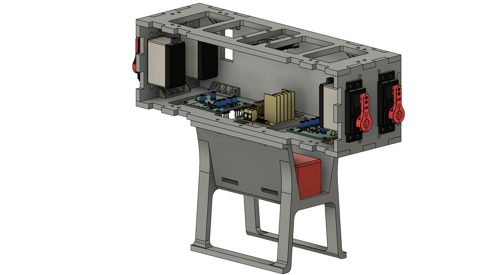

Chassis components:
- [Top Plate](./Top_Plate)
- [Bottom Plate](./Bottom_Plate)
- [Servo Plate](./Servo_Plate)
- [Side Plate](./Side_Plate)
- [L-Joint](./L_Joint)
- [Battery Box](./Battery_Box)

The battery box and the L-joints were 3D printed, while the other components were laser cut.
All laser cut components are from 5mm acrylic sheet. The L-joints were printed at max infill (90%) while the battery box at the normal 30%.

The chassis was assembled using
- 12 L-Joints,
- 2 servo plates,
- 2 side plates,
- 1 top plate,
- 1 bottom plate and
- 1 battery box, 
all of which were fastened using M3 nuts & bolts.

