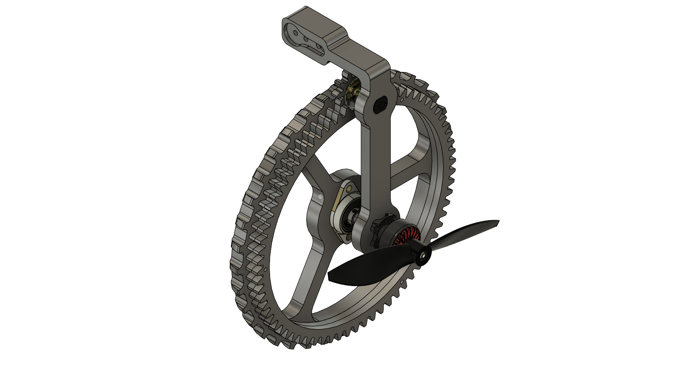

Wheel Assembly Components:
- [Leg](./Leg)
- [Wheel](./Wheel)
- [Gears](./Gears)
  
Wheels and legs were 3D printed while the gears were laser cut. 
The wheel was fastened to the gear using M2 screws. 
The wheel was fastened to the leg through a flange bearing (KFL08) to decouple it from the rest of the leg. 
The wheel was fastened to the bearing using M4 screws while the leg was fastened through the in-built grubs.

The leg was 3D printed at max infill (90%) to ensure structural integrity of the shaft. The wheel was printed at 30% infill. Both of the big gears were laser cut using 3mm acrylic sheet to make a total 6mm thickness. The small gear attached to DC motor was laser cut using 5mm acrylic sheet.

