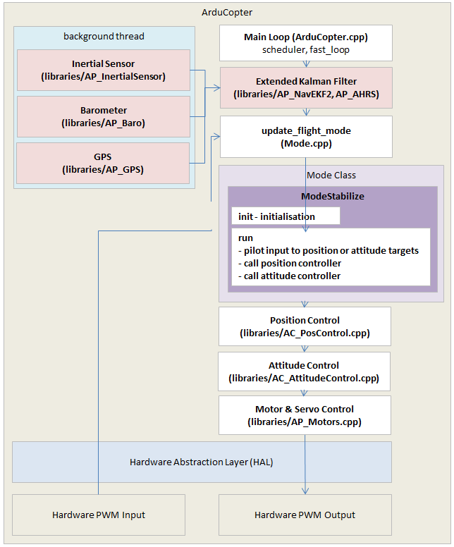

# ArduCopter: Drive & Morph Mode Integration

---

## Official ArduPilot Resources

- [ArduCopter Documentation](https://ardupilot.org/copter/)
- [Learning the ArduPilot Codebase](https://ardupilot.org/dev/docs/learning-the-ardupilot-codebase.html)

We primarily used the **Copter**, with **custom flight modes** for **Drive** and **Morph**.

---

## Custom Flight Modes

### Default + Custom Modes
ArduCopter provides various flight modes like **Stabilize**, **Acro**, **Pos Hold**, and **Acro**. We added two new modes:

- **Drive Mode**
- **Morph Mode**

### Adding New Modes
##
# <a name="_dg07wowim0e1"></a><a name="_1ce6dr2w5jn9"></a>**Different Flight Modes[¶](https://ardupilot.org/copter/docs/common-speedybeef4-v3.html#loading-ardupilot-onto-the-board)**
Arducopter has various flight modes such as Stabilize, Acro, Pos Hold, Loitre, etc. We added Drive and Morph as 2 different modes to these itself.
## <a name="_xxbwp0j6x15k"></a>Adding New Modes:
The instructions are available at:

<https://ardupilot.org/dev/docs/apmcopter-adding-a-new-flight-mode.html> 



---

## RC Channel Mapping

### Mode Switching (via SB, SC, Channel 8)

| **(SB + SC)/2 PWM** | **Mode**                       |
|----------------------|--------------------------------|
| 1000 - 1230          | Drive                          |
| 1230 - 1360          | Morph Up (RC Channel 8 = 2000) |
| 1360 - 1490          | Stabilize                      |
| 1490 - 1620          | Acro                           |
| 1620 - 1749          | Morph Down (RC Channel 8 = 1000) |
| 1750 - 2000          | Pos Hold                       |

Mode assignments are configured in `config.h` and mapped in `Parameters.cpp`.

RC Channel 5 (`SA`) is assigned for **arming the BLDC motors**.
RC Channel 8 is assigned for **direction of morphing**.
---

## Motor Integration

### Motor Types:

1. **DC Motors (Drive Mode)** — Controlled via **L298N**, supports **50 Hz** & **400 Hz**.
2. **BLDC Motors (Drone Mode)** — Standard drone motors, use **400 Hz**.
3. **Servo Motors (Morph Mode)** — Requires **50 Hz** operation.

### BLDC Motors (Pins M1 to M4)
- Standard motor pins for SpeedyBee.

### Servo Motors (Pins M6, M8)
- To use Servo motors in flight modes, we have disabled the SRV_Channels::output_ch_all() in the main motor output function.
- Set output frequency to **50 Hz**:
```cpp
hal.rcout->enable_ch(5);
hal.rcout->enable_ch(7);
hal.rcout->set_output_mode((1UL << 5)|(1UL << 7), AP_HAL::RCOutput::MODE_PWM_NORMAL);
hal.rcout->set_freq((1UL << 5), 50);
hal.rcout->set_freq((1UL << 7), 50);
```
- To write PWM:
```cpp
hal.rcout->write(5, pwm_value);
hal.rcout->write(7, pwm_value);
```

### DC Motors (GPIO Pins 59-62)
- Used alternate pins (R3, T3, R6, T6) configured in `hwdef.dat`:
```c
PC10 ARIN OUTPUT GPIO(59)
PC11 NEEL OUTPUT GPIO(60)
PC6  ARIN_1 OUTPUT GPIO(61)
PC7  NEEL_1 OUTPUT GPIO(62)
```
- Initialize as output pins:
```cpp
hal.gpio->init();
hal.gpio->pinMode(59, HAL_GPIO_OUTPUT);
...
hal.gpio->write(59, t1);
...
```

---

## Drive Mode Logic

Defined in `mode_drive.cpp`

- `init()` is called once
- `run()` is executed at **400 Hz**

### Behavior:
- Using **pitch** for forward/backward motion.
- Using **roll** to turn:
  - Roll ∈ [1250,1750] = Go straight
  - Roll < 1250 = Turn left
  - Roll > 1750 = Turn right

- **Servo PWM values** for drive:
  - Channel 5 = `2000`
  - Channel 7 = `950`

---
GPIO pins are used by re-configuring rx, tx pins in hwdef file.
```cpp
\# USART6 (GPS)
PC6 USART6\_TX USART6
PC7 USART6\_RX USART6

\# USART3 (CAM)
PC10 USART3\_TX USART3 NODMA
PC11 USART3\_RX USART3 NODMA
```
We will change above definitions:

```cpp
PC10 ARIN OUTPUT GPIO(59)
PC11 NEEL OUTPUT GPIO(60)

PC6 ARIN\_1 OUTPUT GPIO(61)
PC7 NEEL\_1 OUTPUT GPIO(62)
```

There are 58 pre-defined GPIO pins on SpeedyBeeF4V4. Thus while creating new GPIO pins, we start numbering from 59 onwards.
The left-right logic is implemented using above values on GPIO pins:
```cpp
hal.gpio->write(59, t1);
hal.gpio->write(60, t2);
hal.gpio->write(61, t3);
hal.gpio->write(62, t4);
```

## Morph Mode Logic
SpeedyBee also has Motor pins M5 to M8 (they can also serve as servo pins) that can be used to connect Motors.

Since Servo Motors must be operated at 50 Hz, we have to choose 2 of the above pins (M6 and M8) and change the operating frequency from 400 Hz to 50 Hz.

- Gradual servo PWM change:
  - Morph Up: `2000 → 1050` & `950 → 1900`
  - Morph Down: reverse

- Only runs every 8th loop for **50 Hz compatibility**
- **DC Motors are stopped** during morph:
```cpp
hal.gpio->write(59, 0);
hal.gpio->write(60, 0);
hal.gpio->write(61, 0);
hal.gpio->write(62, 0);
```
- Triggered by RC Channel 8:
  - 2000 = Morph Up
  - 1000 = Morph Down

---
To implement PWM to servos we have to write the following code in the different modes where we are using these motor pins:
They are enabled as pwm pins and basic ***hal.rcout->write()*** function is used.
```cpp
hal.rcout->enable\_ch(5);
hal.rcout->enable\_ch(7);
```
AP\_HAL::RCOutput::MODE\_PWM\_NORMAL);
```cpp
hal.rcout->set\_output\_mode((1UL << 5)|(1UL << 7), AP\_HAL::RCOutput::MODE\_PWM\_NORMAL);
hal.rcout->set\_freq((1UL << 5), 50);
hal.rcout->set\_freq((1UL << 7), 50);
```

Whenever we want to write a PWM value to these motor pin channels, we can use:
```cpp
hal.rcout->write(5, pwm\_value);
hal.rcout->write(7, pwm\_value);
```
## Drone Modes Used

- [Stabilize Mode](https://ardupilot.org/copter/docs/stabilize-mode.html)
- [Acro Mode](https://ardupilot.org/copter/docs/acro-mode.html)
- [PosHold Mode](https://ardupilot.org/copter/docs/poshold-mode.html)

---
Servo pwm also sent in drone modes to keep legs upright in position.

## Parameter Setup (config.h)

Update using **Mission Planner** or directly edit `default.param` in hwdef files:

### Required Settings:
```ini
ARMING_CHECK,1047038
AHRS_ORIENTATION,8
COMPASS_AUTO_ROT,0
COMPASS_AUTODEC,0
COMPASS_ENABLE,0
FRAME_CLASS,1
FRAME_TYPE,3
RC5_OPTION,153
SERVO1_FUNCTION,33
SERVO2_FUNCTION,36
SERVO3_FUNCTION,34
SERVO4_FUNCTION,35
SERVO6_FUNCTION,0
SERVO8_FUNCTION,0
SERVO9_FUNCTION,0
```

### Notes:
- `AHRS_ORIENTATION = 8` (Roll180) due to inverted mount
- `COMPASS_ENABLE = 0` (No compass)
- Servo function values map ESCs to PWM outputs

---

> For more details, refer to the [official ArduPilot flight modes guide](https://ardupilot.org/copter/docs/flight-modes.html).
